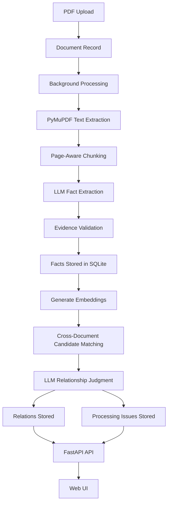

# Fact Knowledge Layer Assignment
A FastAPI application that extracts facts from PDFs, connects each fact to source evidence, and compares facts across documents.
## Setup and Run
```bash
git clone https://github.com/0DhruvHere0/Superjoin-Intership-Project.git
cd Superjoin-Intership-Project
python3 -m venv .venv
source .venv/bin/activate
pip install -r requirements.txt
cp .env.example .env
```
Add the Gemini configuration to `.env`:
```env
GEMINI_API_KEY=your_api_key
GEMINI_MODEL=gemini-3.5-flash-lite
GEMINI_EMBEDDING_MODEL=gemini-embedding-001
```
Start the application:
```bash
uvicorn app.main:app --reload
```
Open the application at:
```text
http://127.0.0.1:8000
```
API documentation:
```text
http://127.0.0.1:8000/docs
```
Never commit `.env` because it contains private credentials.
## Video Demo
[Watch the three-minute demo] https://youtu.be/2-vBzy5p4CU'\n'
The demo shows PDF upload, background processing, extracted facts, source evidence, cross-document relationships, and failure handling.
## Approach
The system follows this pipeline:
```text
PDF Upload
→ Page-Aware Text Extraction
→ Text Chunking
→ LLM Fact Extraction
→ Evidence Validation
→ Embeddings
→ Cross-Document Matching
→ Relationship Judgment
→ SQLite Storage
→ FastAPI and Web UI
```

The system separates fact discovery from relationship reasoning. Facts are first extracted and validated against their source evidence. Embeddings then identify potentially related facts across documents, and a second LLM call explains their relationship.
Each fact contains:
- Subject
- Predicate
- Value
- Unit
- Time scope
- Confidence
- Evidence quote
- Source page
Relationships are classified as:
- `corroborate`
- `contradict`
- `reconcile`
- `unrelated`
## LLM Prompting and Output Control
The fact extraction prompt instructs Gemini to:
- Extract meaningful atomic facts.
- Include the subject, predicate, value, unit, and time scope.
- Preserve the original evidence quote.
- Avoid inventing information.
- Return a confidence score.
- Return structured JSON only.
A simplified response looks like this:
```json
{
  "facts": [
    {
      "subject": "Example Company",
      "predicate": "annual revenue",
      "value": "100",
      "unit": "₹ Cr",
      "time_scope": "FY24",
      "confidence": 0.92,
      "raw_statement": "Annual revenue was ₹100 Cr.",
      "quote": "Annual revenue was ₹100 Cr."
    }
  ]
}
```
The relationship prompt compares two facts using their subject, predicate, value, unit, time scope, and evidence. It returns one relationship type and an explanation.
Pydantic validation checks the model response. Invalid JSON, missing fields, unsupported relationship types, and missing evidence are recorded as processing issues.
The prompts are implemented in:
- `app/pipeline/fact_extractor.py`
- `app/pipeline/judge.py`
## Important Decisions
- **FastAPI:** Provides the API and background processing.
- **SQLite:** Keeps the prototype simple and easy to run.
- **PyMuPDF:** Extracts text while preserving page information.
- **Embeddings:** Find semantically related facts before expensive LLM comparison.
- **Evidence validation:** Prevents unsupported facts from being accepted.
- **Rate limiting and retries:** Reduce failures caused by API quotas and temporary provider errors.
- **Flexible fact schema:** Supports different document types without hard-coded fields.
- **Stored unrelated pairs:** Prevents the same pair from being judged repeatedly.
## Required Cases
### Corroboration
The system identifies when two documents support the same underlying claim, even if the wording is different and the values use compatible representations.
### Contradiction
The system identifies when two documents refer to the same subject, predicate, time period, and scope but contain incompatible values.
### Reconciliation
The system identifies when two values appear different but the difference is explained by units, time periods, scopes, or estimates versus actual results.
### Extraction or Reasoning Failure
The system can encounter:
- Malformed model output
- Unsupported evidence quotes
- API quota errors
- Incorrect interpretation of tables or charts
- Incorrect relationship judgments
These issues are stored against the document and shown under Processing Issues instead of being silently ignored.
The video demonstrates actual examples of corroboration, contradiction, reconciliation, and failure handling using uploaded PDFs.
## API Endpoints
```text
GET  /health
POST /upload
GET  /documents
GET  /documents/{document_id}
POST /documents/{document_id}/reprocess
```
The document details endpoint returns:
- Document metadata
- Extracted facts
- Cross-document relationships
- Processing issues
## Limitations and Next Steps
Current limitations include:
- Scanned PDFs require OCR.
- Tables and charts can be misinterpreted.
- LLM confidence scores may be overconfident.
- Free API quotas can slow down processing.
- Relationship judgments require manual review.
- Page ranges may sometimes be broader than the exact source page.
- Unit normalization is not yet comprehensive.
Planned improvements include:
- OCR support.
- Layout-aware table and chart extraction.
- Better unit normalization.
- Improved confidence calibration.
- More precise page tracking.
- More efficient batch processing.
- Scheduled retry handling for temporary failures.
- Automated tests for extraction and relationship classification.
## AI Tools Used
- Gemini text model for fact extraction and relationship judgment.
- Gemini embedding model for semantic similarity search.
- Coding assistants for implementation and debugging.
## Additional Notes
The system does not hard-code facts, filenames, or document-specific rules. New PDFs can be uploaded through the same interface and processed using the same pipeline.
The main design principles are:
```text
Every fact has evidence.
Every relationship has an explanation.
Every failure is visible.
```
API credentials are stored only in `.env`, which is excluded from version control.